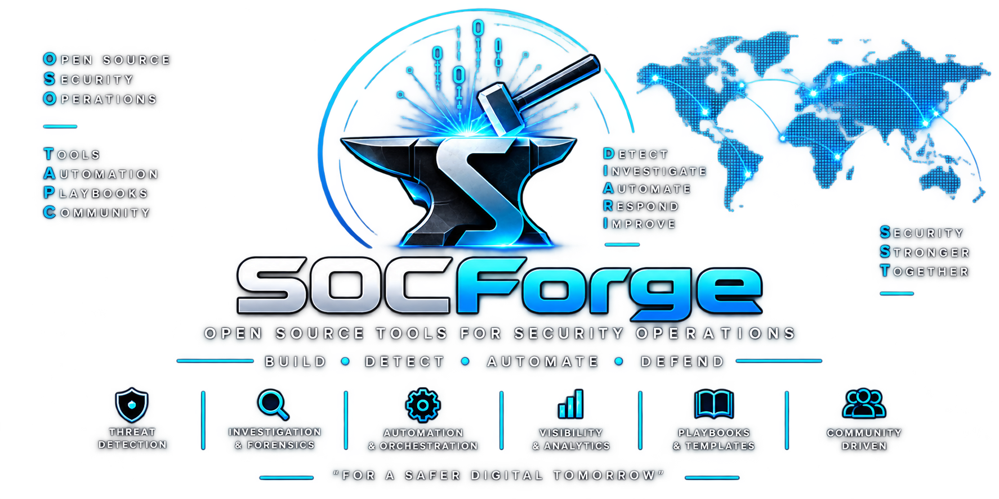
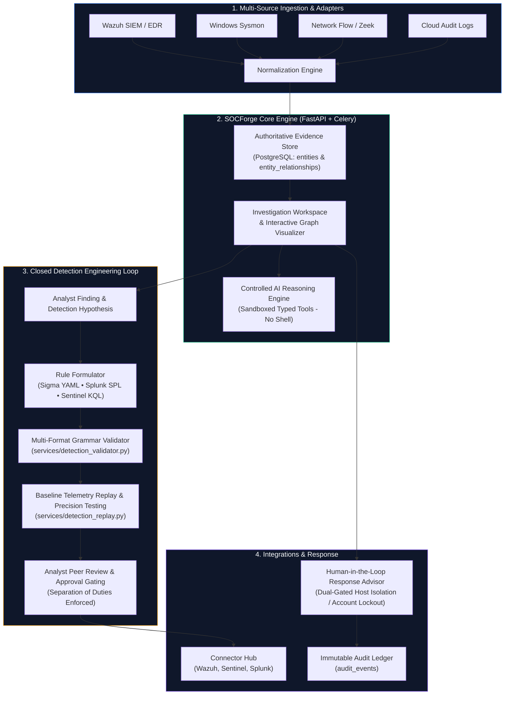
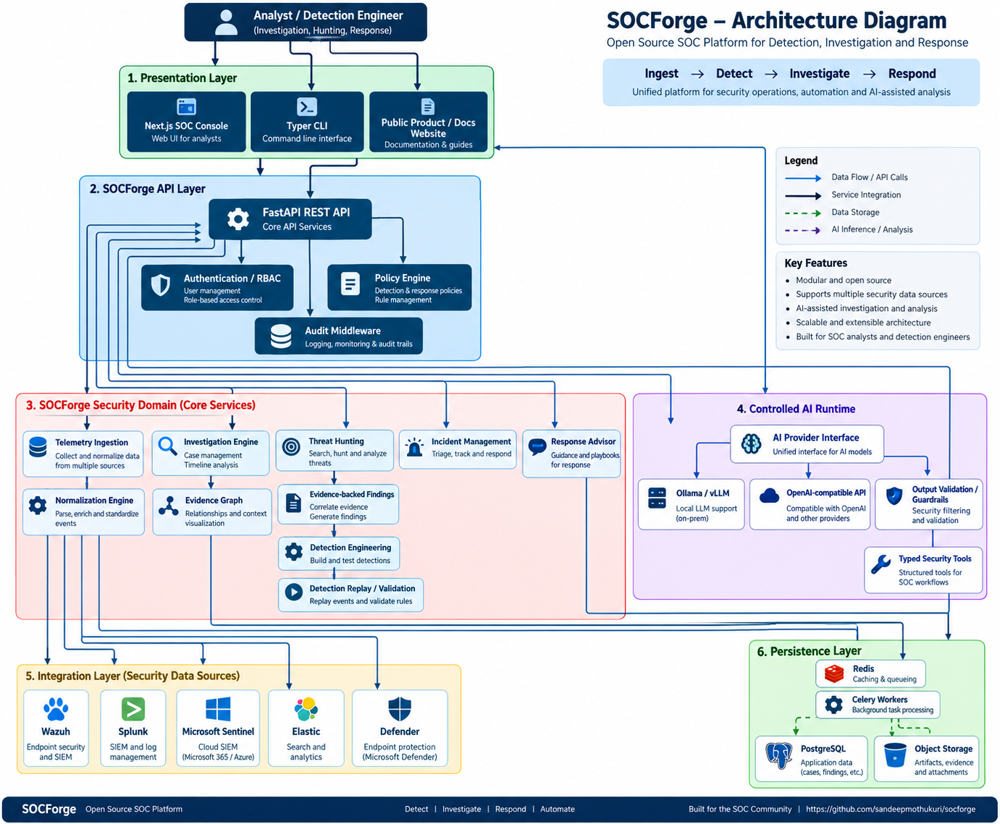
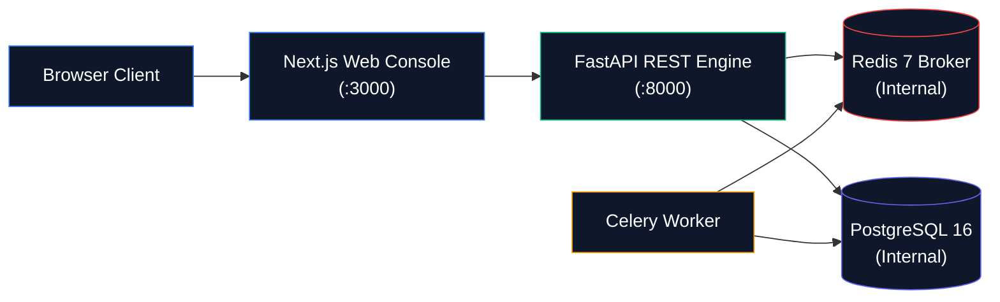
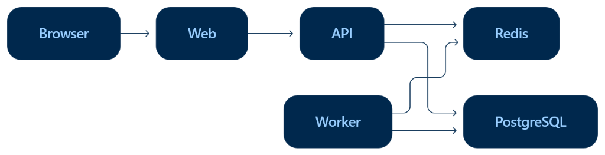
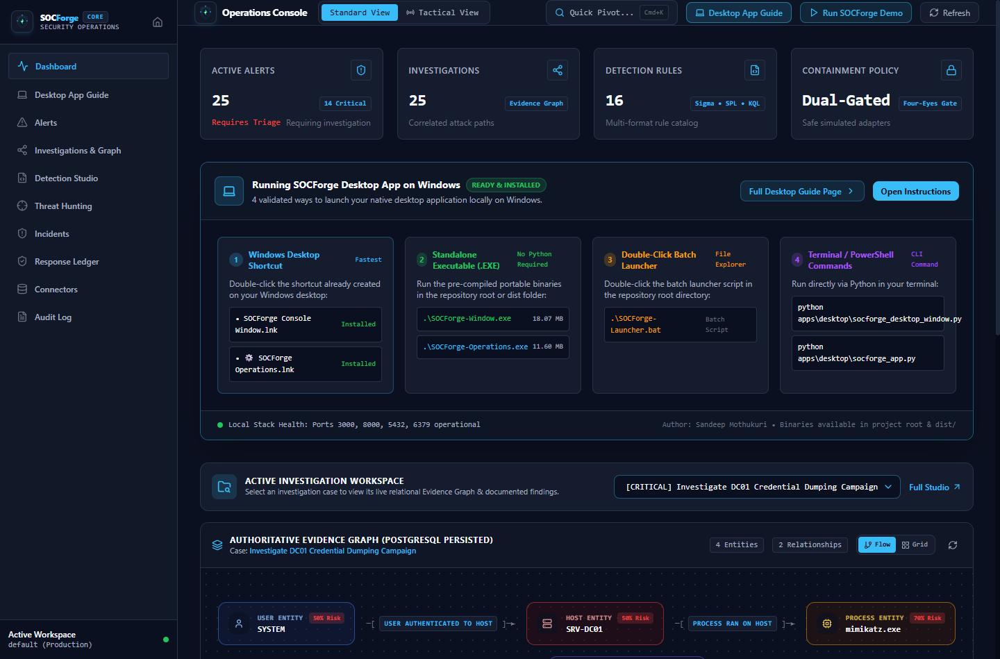
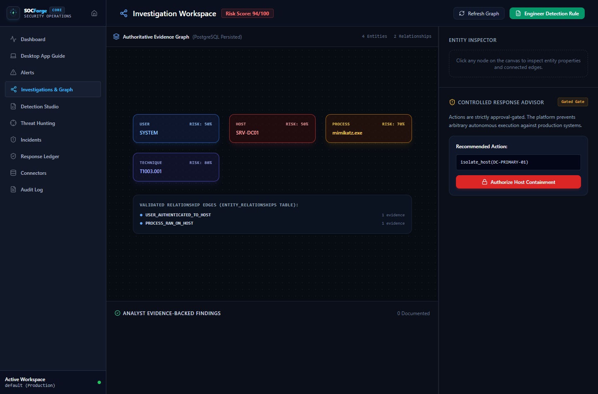
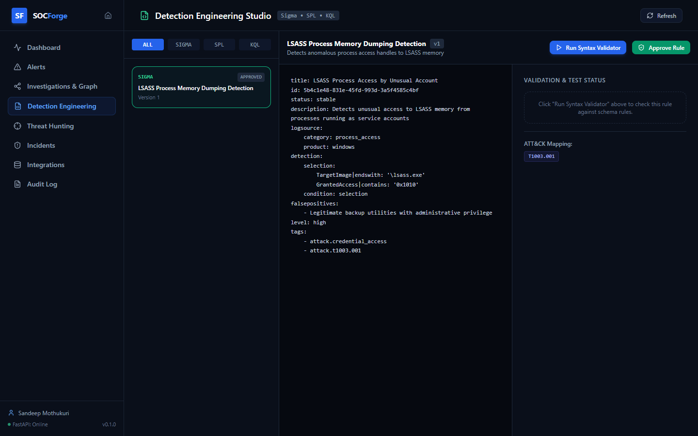
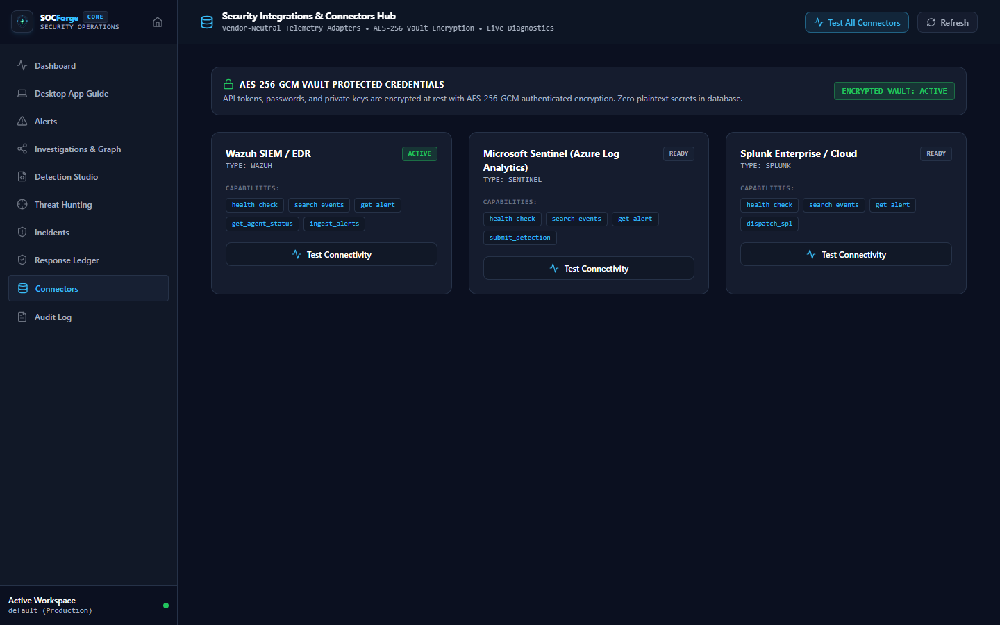

<p align="center">
  
</p>

<p align="center">
  <strong>Evidence-Driven Security Operations Platform for Investigation, Threat Hunting, and Detection Engineering</strong>
</p>

<p align="center">
  <a href="LICENSE"></a>
  
  
  
  
  
</p>

**Author**: [Sandeep Mothukuri](https://github.com/sandeepmothukuri)  
**Website**: [https://cybertechnology.in](https://cybertechnology.in)

---

## 1. What is SOCForge?

SOCForge is a vendor-neutral security operations engineering platform that transforms security telemetry into **authoritative evidence graphs**, **investigation findings**, **validated detection rules (Sigma, SPL, KQL)**, and **human-gated response decisions**.

Traditional security operations platforms act as passive alert viewers or unindexed log searchers. SOCForge closes the operational gap between triage, investigation, and detection engineering:



---

## 2. Platform Architecture

### Component & Dataflow Overview
The architecture is structured around strict separation of concerns, non-root isolated containers, an authoritative relational evidence store, and approval-gated containment workflows.



### High-Level Service Interaction




### Repository Directory Layout
```
socforge/
├── apps/
│   ├── api/
│   │   ├── socforge/
│   │   │   ├── auth/            # JWT, API keys, RBAC, workspace auth, secret encryption
│   │   │   ├── agents/          # Controlled AI agents, typed Pydantic contracts, tools
│   │   │   ├── integrations/    # SIEM/EDR connectors (Wazuh, Splunk, Sentinel)
│   │   │   ├── models/          # SQLAlchemy 2.0 async models
│   │   │   ├── routers/         # FastAPI endpoint routers (Alerts, Invs, Detections, etc.)
│   │   │   ├── schemas/         # Shared Pydantic validation schemas
│   │   │   ├── services/        # Replay engine, rule validators, audit logging
│   │   │   ├── policies/        # Response containment & approval policies
│   │   │   ├── repositories/    # Database query abstraction
│   │   │   ├── normalization/   # Telemetry normalizer
│   │   │   ├── detection/       # Rule formulation logic
│   │   │   ├── investigations/  # Evidence graph builders
│   │   │   ├── response/        # Response adapters & execution dispatcher
│   │   │   ├── config.py        # Settings with production credential validators
│   │   │   ├── database.py      # Async engine & session lifecycle
│   │   │   └── main.py          # FastAPI application factory
│   │   ├── alembic/             # Version-controlled database migrations
│   │   ├── tests/               # Unit and integration test suites
│   │   └── pyproject.toml
│   │
│   ├── web/                     # Next.js 14 Web Console
│   │   ├── src/
│   │   │   ├── app/             # App Router pages (Dashboard, Alerts, Invs, etc.)
│   │   │   ├── components/      # UI component library, AppShell, Graph visualizers
│   │   │   ├── lib/             # API client & data fetchers
│   │   │   ├── hooks/           # Custom React hooks
│   │   │   └── types/           # TypeScript contracts
│   │   └── package.json
│   │
│   └── cli/                     # SOCForge Terminal CLI (Typer & Rich)
│
├── workers/                     # Celery background workers
├── detections/                  # Sigma, SPL, KQL detection rules & test cases
├── datasets/                    # Labeled telemetry datasets (synthetic-soc-v1.json)
├── deployments/                 # Hardened Dockerfiles (API & Web non-root)
└── docs/                        # Architecture, API, deployment, security guides
```

---

## 3. Platform Verification & Screenshots

### Security Operations Command Center
High-density tactical operations dashboard tracking MTTD, MTTR, high-risk entity pivots, active investigations, and MITRE ATT&CK technique matrix.


---

### Interactive Evidence Graph
Typed graph visualizer mapping directed entity relationships (`User` → `Host` → `Process` → `Domain` → `MITRE ATT&CK`) with supporting event backing.


---

### Detection Engineering Studio
Lifecycle management for Sigma YAML, Splunk SPL, and Microsoft Sentinel KQL detection rules with AST grammar validation, separation-of-duties approval gating, and confusion-matrix replay testing.


---

### Security Connectors & Integrations Hub
Vendor-neutral adapters connecting external SIEM, EDR, and log analytics platforms into SOCForge normalized schemas with live connectivity diagnostics and AES-256 secret encryption.


---

## 4. Capability Implementation Status

To ensure complete transparency and technical credibility, platform capabilities are classified into four explicit tiers:

| Tier | Capabilities |
|---|---|
| **Implemented (Verified in CI & Tests)** | • **Server-Side Workspace Isolation**: Multi-tenant database boundary via `WorkspaceMembership`, role-based access control, and workspace-scoped queries.<br>• **Relational Evidence Graph**: Entity relationships backed by PostgreSQL foreign keys and `finding_events` / `finding_entities` association tables.<br>• **Detection Replay Engine**: Real confusion-matrix evaluation against `synthetic-soc-v1.json` computing true TP, FP, FN, TN, Precision, Recall, and F1.<br>• **Separation of Duties**: Author cannot approve their own detection rule; requester cannot approve their own response action.<br>• **Typed AI Contracts**: Sandboxed AI agents returning strictly validated Pydantic schemas (`TriageResult`, `InvestigationResult`, `FindingProposal`, `DetectionProposal`, `ThreatHuntResult`, `ReportResult`).<br>• **Connector Secret Encryption**: In-database AES-256 (Fernet) encryption for SIEM/EDR API keys and passwords; secrets stripped from API responses.<br>• **Simulated Response Execution**: Containment actions execute via `MockResponseAdapter` clearly marked as `SIMULATED` with dry-run parameters.<br>• **Alembic Migrations**: All schema modifications managed exclusively through versioned migrations (`0001_initial_schema`, `0002_finding_evidence_tables`).<br>• **Non-Root Containers**: Docker builds for API and Web run under dedicated unprivileged users (`appuser` UID 1000, `nextjs` UID 1001). |
| **Supported (Integrated & Extensible)** | • **Wazuh SIEM / EDR**: Health checks, event querying, and active response via REST API.<br>• **Splunk Enterprise / Cloud**: HTTP Event Collector (HEC) ingestion and search API query translation.<br>• **Microsoft Sentinel**: Log Analytics workspace queries and incident correlation.<br>• **Custom Dataset Evaluation**: Detection testing accepts arbitrary labeled JSON telemetry datasets. |
| **Experimental** | • **Live AI Provider Integration**: Anthropic Claude, OpenAI, and local Ollama integrations for automated hypothesis drafting.<br>• **Automated Attack Path Inferences**: Graph traversal heuristics for lateral movement sequence generation. |
| **Planned** | • **STIX 2.1 / TAXII Feed Ingestion**: Ingest external threat intelligence IOCs directly into the entity repository.<br>• **Kubernetes Helm Charts**: Production deployment manifests for HA PostgreSQL and clustered Celery workers. |

---

## 5. Quick Start (One Command)

```bash
git clone https://github.com/sandeepmothukuri/socforge.git
cd socforge
cp .env.example .env
docker compose up -d
```

### Access Endpoints:
- **Web Console**: [http://localhost:3000](http://localhost:3000)
- **API Engine**: [http://localhost:8000](http://localhost:8000)
- **Interactive API Documentation (Swagger)**: [http://localhost:8000/docs](http://localhost:8000/docs)
- **Health Probe**: [http://localhost:8000/health](http://localhost:8000/health)

---

## 6. Deterministic Demo Workflow

Experience the complete end-to-end investigation and detection workflow immediately with realistic synthetic SOC telemetry via live API operations:

```bash
# Seed demo database
docker compose exec api python -m socforge.seed

# Run end-to-end demo workflow via the SOCForge CLI
socforge demo
```

The demo workflow executes real API calls:
1. Connects to the API and authenticates as the administrator.
2. Ingests a critical **Mimikatz LSASS process creation alert** mapped to `T1003.001`.
3. Creates an active **Investigation** linked to the alert.
4. Generates an evidence-backed **Finding** with explicit technical justification.
5. Formulates a **Sigma detection rule**, performs syntax validation, and runs the **Detection Replay Engine** against `synthetic-soc-v1.json` to compute precision and recall metrics.

---

## 7. Security & Threat Model

See [docs/security/threat-model.md](docs/security/threat-model.md) for full threat boundaries, prompt injection mitigations, and RBAC implementation details.

---

## 8. License

Licensed under the Apache License, Version 2.0. See [LICENSE](LICENSE) for details.
