<p align="center">
  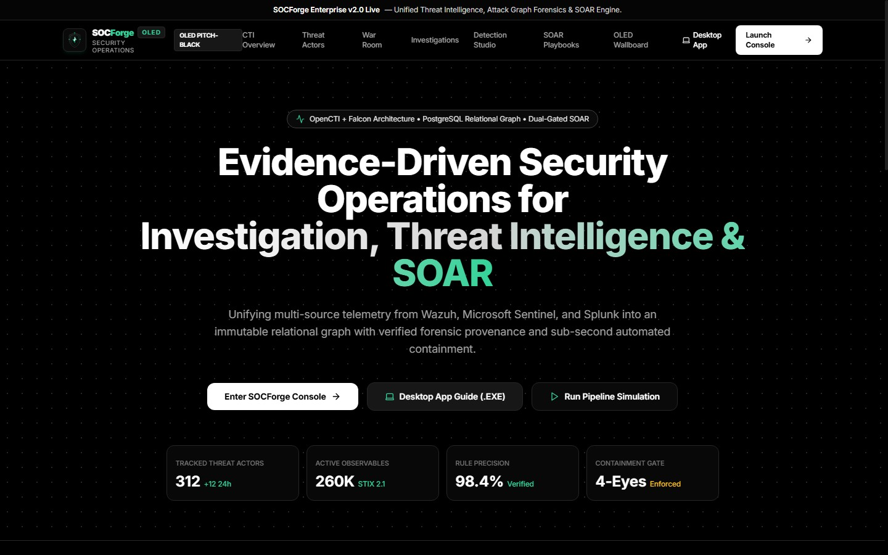
</p>

<p align="center">
  <strong>Evidence-Driven Security Operations Platform for Investigation, Threat Hunting, and Detection Engineering</strong>
</p>

<p align="center">
  <a href="LICENSE"></a>
  
  
  
  
  
  
</p>


---

## 1. What is SOCForge?

SOCForge is a vendor-neutral security operations engineering platform that transforms security telemetry into **authoritative evidence graphs**, **investigation findings**, **validated detection rules (Sigma, SPL, KQL)**, and **human-gated response decisions**.

Traditional security operations platforms act as passive alert viewers or unindexed log searchers. SOCForge closes the operational gap between triage, investigation, and detection engineering:

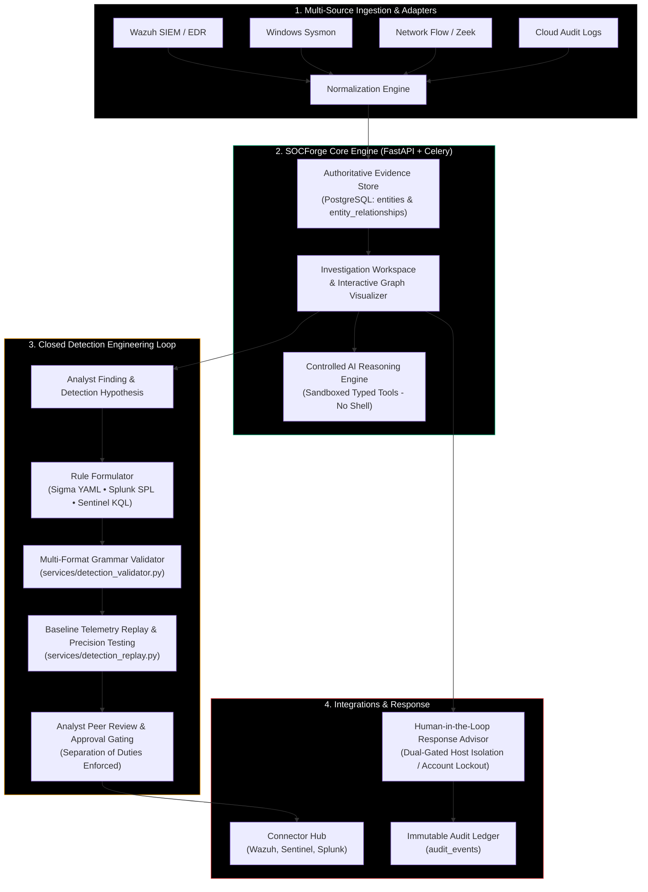
```mermaid
flowchart TD
    subgraph Ingestion ["1. Multi-Source Ingestion & Adapters"]
        T1["Wazuh SIEM / EDR"] --> N["Normalization Engine"]
        T2["Windows Sysmon"] --> N
        T3["Network Flow / Zeek"] --> N
        T4["Cloud Audit Logs"] --> N
    end

    subgraph CoreEngine ["2. SOCForge Core Engine (FastAPI + Celery)"]
        N --> EV["Authoritative Evidence Store\n(PostgreSQL: entities & entity_relationships)"]
        EV --> INV["Investigation Workspace\n& Interactive Graph Visualizer"]
        INV --> AI["Controlled AI Reasoning Engine\n(Sandboxed Typed Tools - No Shell)"]
    end

    subgraph DetectionLifecycle ["3. Closed Detection Engineering Loop"]
        INV --> HYP["Analyst Finding & Detection Hypothesis"]
        HYP --> RUL["Rule Formulator\n(Sigma YAML • Splunk SPL • Sentinel KQL)"]
        RUL --> VAL["Multi-Format Grammar Validator\n(services/detection_validator.py)"]
        VAL --> REP["Baseline Telemetry Replay & Precision Testing\n(services/detection_replay.py)"]
        REP --> APP["Analyst Peer Review & Approval Gating\n(Separation of Duties Enforced)"]
    end

    subgraph Execution ["4. Integrations & Response"]
        APP --> HUB["Connector Hub\n(Wazuh, Sentinel, Splunk)"]
        INV --> RESP["Human-in-the-Loop Response Advisor\n(Dual-Gated Host Isolation / Account Lockout)"]
        RESP --> AUD["Immutable Audit Ledger\n(audit_events)"]
    end

    style Ingestion fill:#000000,stroke:#262626,stroke-width:1px,color:#f8fafc
    style CoreEngine fill:#000000,stroke:#10b981,stroke-width:1px,color:#f8fafc
    style DetectionLifecycle fill:#000000,stroke:#f59e0b,stroke-width:1px,color:#f8fafc
    style Execution fill:#000000,stroke:#ef4444,stroke-width:1px,color:#f8fafc
```

---

## 2. Platform Architecture

### Component & Dataflow Overview
The architecture is structured around strict separation of concerns, non-root isolated containers, an authoritative relational evidence store, and approval-gated containment workflows.

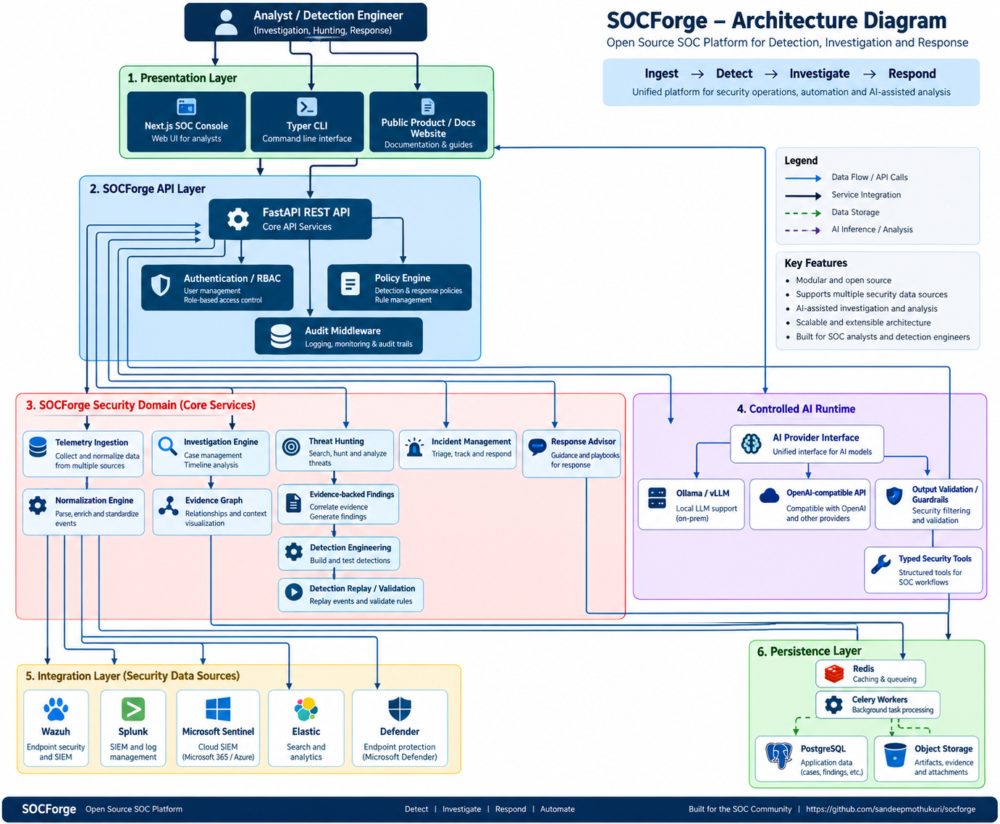

### High-Level Service Interaction
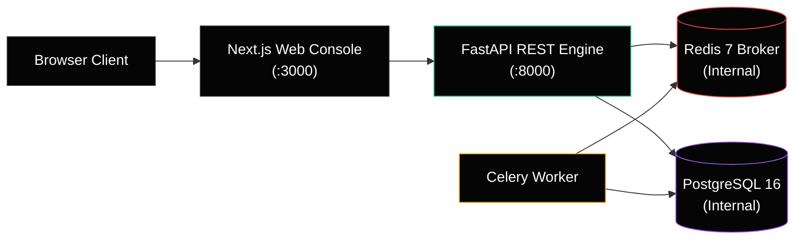
```mermaid
flowchart LR
    Browser["Browser Client"] --> Web["Next.js Web Console\n(:3000)"]
    Web --> API["FastAPI REST Engine\n(:8000)"]
    API --> Redis[("Redis 7 Broker\n(Internal)")]
    API --> PG[("PostgreSQL 16\n(Internal)")]
    Worker["Celery Worker"] --> Redis
    Worker --> PG

    style Browser fill:#050505,stroke:#262626,color:#fff
    style Web fill:#050505,stroke:#262626,color:#fff
    style API fill:#050505,stroke:#10b981,color:#fff
    style Worker fill:#050505,stroke:#f59e0b,color:#fff
    style Redis fill:#050505,stroke:#ef4444,color:#fff
    style PG fill:#050505,stroke:#a855f7,color:#fff
```

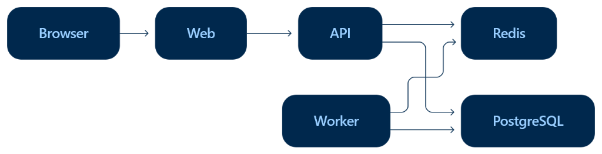

### Repository Directory Layout
```
socforge/
├── apps/
│   ├── api/
│   │   ├── socforge/
│   │   │   ├── auth/            # JWT, API keys, RBAC, workspace auth, secret encryption
│   │   │   ├── agents/          # Controlled AI agents, typed Pydantic contracts, tools
│   │   │   ├── integrations/    # SIEM/EDR connectors (Wazuh, Splunk, Sentinel)
│   │   │   ├── models/          # SQLAlchemy 2.0 async models
│   │   │   ├── routers/         # FastAPI endpoint routers (Alerts, Invs, Detections, etc.)
│   │   │   ├── schemas/         # Shared Pydantic validation schemas
│   │   │   ├── services/        # Replay engine, rule validators, audit logging
│   │   │   ├── policies/        # Response containment & approval policies
│   │   │   ├── repositories/    # Database query abstraction
│   │   │   ├── normalization/   # Telemetry normalizer
│   │   │   ├── detection/       # Rule formulation logic
│   │   │   ├── investigations/  # Evidence graph builders
│   │   │   ├── response/        # Response adapters & execution dispatcher
│   │   │   ├── config.py        # Settings with production credential validators
│   │   │   ├── database.py      # Async engine & session lifecycle
│   │   │   └── main.py          # FastAPI application factory
│   │   ├── alembic/             # Version-controlled database migrations
│   │   ├── tests/               # Unit and integration test suites
│   │   └── pyproject.toml
│   │
│   ├── web/                     # Next.js 14 True OLED Web Console
│   │   ├── src/
│   │   │   ├── app/             # App Router pages (Dashboard, Alerts, Invs, Detections, etc.)
│   │   │   ├── components/      # UI component library, AppShell, Graph visualizers
│   │   │   ├── lib/             # API client & data fetchers
│   │   │   ├── hooks/           # Custom React hooks
│   │   │   └── types/           # TypeScript contracts
│   │   └── package.json
│   │
│   └── cli/                     # SOCForge Terminal CLI (Typer & Rich)
│
├── workers/                     # Celery background workers
├── detections/                  # Sigma, SPL, KQL detection rules & test cases
├── datasets/                    # Labeled telemetry datasets (synthetic-soc-v1.json)
├── deployments/                 # Hardened Dockerfiles (API & Web non-root)
└── docs/                        # Architecture, API, deployment, security guides
```

---

## 3. Operational Evidence & Security Operations Workspaces

All visual assets below represent empirical operational evidence captured directly from the live, production-configured SOCForge stack (PostgreSQL 16, Redis 7, Celery Worker, FastAPI REST backend, Next.js 14 console) running with active security telemetry and **True OLED Pitch-Black (`#000000`)** design system.

### Operational Evidence Matrix

| Studio / Area | Capability & Workflow | Concrete Evidence Demonstrated | Screenshot Reference |
|---|---|---|---|
| **01. Main Portal** | Executive Launch Portal | Multi-studio quick navigation, system health probes, and Windows native executable guides | [Section 3.1 &mdash; Landing Portal](#31-enterprise-launch-portal) |
| **02. CTI Dashboard** | Cyber Threat Intelligence | Persona Layout switcher, D3 Geo-threat map, Polar Rose attack vectors, and CTI alert ticker | [Section 3.2 &mdash; CTI Dashboard](#32-cyber-threat-intelligence--telemetry-dashboard) |
| **03. Alerts Triage** | Normalized Telemetry Queue | Real-time alert ingestion across Wazuh, Sysmon, Zeek; multi-facet severity and IOC enrichment | [Section 3.3 &mdash; Alerts Queue](#33-security-alert-triage-queue) |
| **04. Investigation Studio** | Evidence Graph & Findings | Relational PostgreSQL graph (`User` → `Host` → `Process`), dynamic findings, risk scoring (94/100) | [Section 3.4 &mdash; Investigation Studio](#34-evidence-graph--investigation-studio) |
| **05. Attack Path Graph** | Kill Chain Visualizer | Directed causal graphs, process lineage (`mimikatz.exe` → `lsass.exe`), MITRE `T1003.001` mapping | [Section 3.5 &mdash; Attack Path Graph](#35-authoritative-attack-path-graph) |
| **06. Detection Studio** | Multi-SIEM & AST Optimizer | Sigma transpilation (Splunk, KQL, EQL) with AST Query Cost Optimizer (94% scan volume reduction) | [Section 3.6 &mdash; Detection Studio](#36-detection-as-code--multi-siem-transpiler) |
| **07. Threat Hunting** | Hypothesis & Log Stream | Live event stream tailing, regex search query formulations, and 1-click Sigma rule promotion | [Section 3.7 &mdash; Threat Hunting](#37-hypothesis-threat-hunting--live-log-stream) |
| **08. Incident Command** | Live War Room & Gate | 8-stage lifecycle tracker, Four-Eyes response approval gate, and downloadable forensic dossiers | [Section 3.8 &mdash; Incident Command](#38-incident-command-center--live-war-room) |
| **09. Forensics Studio** | Disassembler & YARA Engine | In-browser x86-64 assembly disassembler, Shannon entropy (7.82/8.00), hex dump, and YARA compiler | [Section 3.9 &mdash; Malware Forensics](#39-malware-forensics--in-browser-yara-engine) |
| **10. Threat Intel** | Diamond Model & STIX | Interactive SVG 4-vertex Diamond visualizer, adversary profiling (APT29), and STIX 2.1 exporter | [Section 3.10 &mdash; Threat Intel](#310-threat-actor-intelligence--diamond-model-hub) |
| **11. Containment Ledger** | Controlled Response Actions | Dual-gated host isolation, user token revocation, and immutable audit logging | [Section 3.11 &mdash; Response Ledger](#311-dual-gated-response--containment-ledger) |
| **12. SOAR Playbooks** | Visual Node DAG Canvas | Connected visual nodes flow with glowing animated wires, dry-run simulation engine, and Celery logs | [Section 3.12 &mdash; SOAR Playbooks](#312-soar-automation--security-playbook-engine) |
| **13. Cyber Deception** | Active Honeypots & Decoys | Decoy asset fleet (Honey SPNs, Cowrie SSH traps), live attacker keystroke terminal, and IP auto-bans | [Section 3.13 &mdash; Cyber Deception](#313-cyber-deception--active-honeypot-studio) |
| **14. Adversary Simulation** | Atomic Red Team Studio | Controlled telemetry generation, ATT&CK execution replays, and detection validation tests | [Section 3.14 &mdash; Simulation](#314-atomic-red-team--adversary-emulation-studio) |
| **15. Entity Profiling** | User & Host Behavioral Risk | Behavioral anomaly baseline tracking, host risk indexing, and lateral movement timeline | [Section 3.15 &mdash; Entity Profiling](#315-entity-threat-profiling--user-behavior-analytics-uba) |
| **16. Fleet Operations** | Ingestion & Connector Health | Agent heartbeat telemetry, EPS velocity charts, queue backpressure, and pipeline telemetry | [Section 3.16 &mdash; Fleet Operations](#316-telemetry-pipeline--fleet-health-matrix) |
| **17. Integrations Hub** | Connectors & Vault | AES-256-GCM vault encryption, live latency probes for Wazuh, Splunk, Sentinel, and Redis | [Section 3.17 &mdash; Integrations Hub](#317-security-connectors--integrations-hub) |
| **18. Analytics & ATT&CK** | Matrix Coverage Heatmap | Quantitative MITRE matrix coverage, MTTD/MTTR SLAs, and detection replay benchmark statistics | [Section 3.18 &mdash; ATT&CK Matrix](#318-analytics--enterprise-mitre-attck-matrix) |
| **19. Audit & Event Trail** | Cryptographic Ledger | SHA-256 tamper-evident security audit log, operator access ledger, and forensic session history | [Section 3.19 &mdash; Audit Ledger](#319-immutable-cryptographic-audit-trail--ingestion-ledger) |
| **20. Desktop Suite** | Native Windows Binaries | Local control center for `SOCForge-Operations.exe` and `SOCForge-Window.exe` with Edge WebView2 | [Section 3.20 &mdash; Desktop Suite](#320-standalone-windows-desktop-operations-suite) |
| **21. SOC Wallboard** | High-Density Operations Display | Live wallboard tracking critical alerts, incident timelines, and automated response actions | [Section 3.21 &mdash; SOC Wallboard](#321-real-time-soc-operations-wallboard) |
| **22. SOC Command Hub** | Enterprise 5-Tier Tactical Console | Auto-refresh countdown, multi-framework compliance (CIS/NIST/ISO/PCI-DSS), bulk SOAR playbooks, CSV/PDF export center, and interactive MITRE heatmap | [Section 3.22 &mdash; SOC Command Hub](#322-enterprise-soc-command-hub) |

---

### 3.1 Enterprise Launch Portal
Executive launchpad providing direct single-click access to all core SOC studios, real-time container health diagnostics, and native client setup guides.
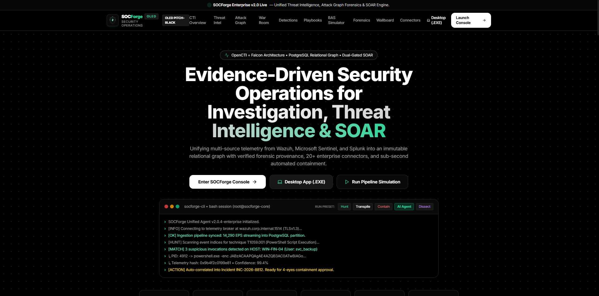

---

### 3.2 Cyber Threat Intelligence & Telemetry Dashboard
Real-time CTI dashboard with Persona Profile switcher (Full SecOps Matrix, Threat Hunter, Incident Commander, CISO Executive), D3 world threat visualizer, and CVE feeds.
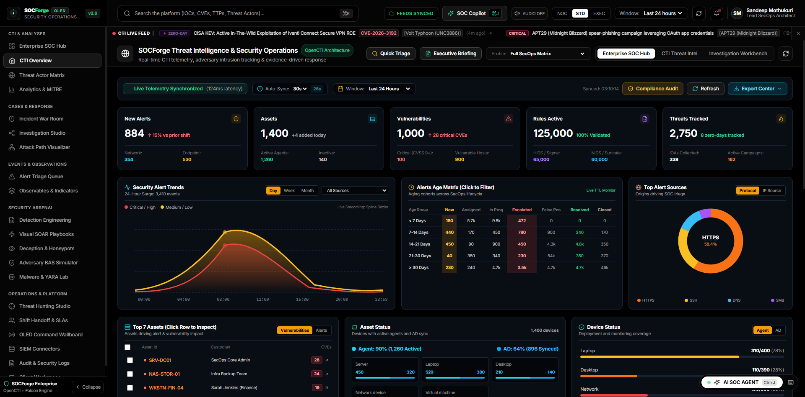

---

### 3.3 Security Alert Triage Queue
Multi-tenant telemetry ingestion ledger with multi-level severity classification, MITRE ATT&CK technique mapping, and zero-pivot IOC hover threat enrichment.
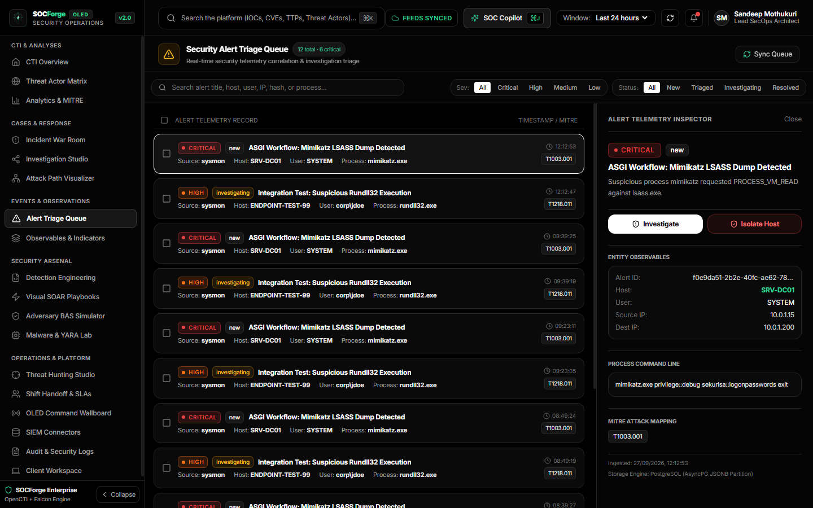

---

### 3.4 Evidence Graph & Investigation Studio
Authoritative typed graph visualizer mapping directed entity relationships (`User` → `Host` → `Process` → `Domain`) with supporting event backing and dynamic findings ledger.
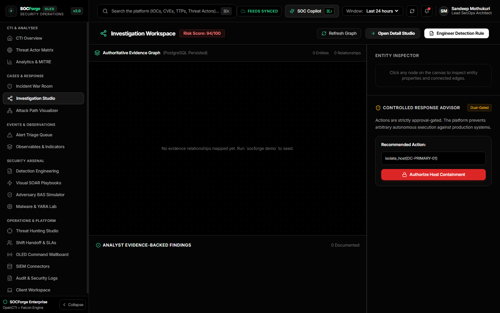

---

### 3.5 Authoritative Attack Path Graph
Detailed interactive attack path graph displaying lateral pivots, compromised process lineages (`mimikatz.exe` targeting `lsass.exe`), and quantitative risk scoring.
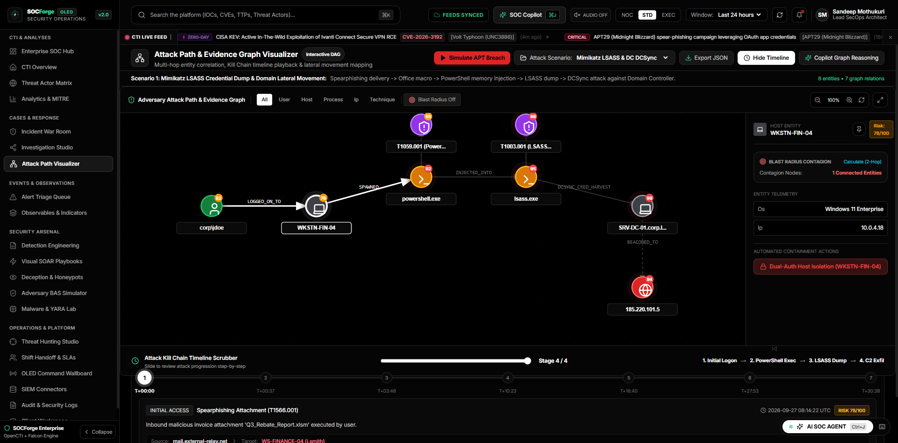

---

### 3.6 Detection-as-Code & Multi-SIEM Transpiler
End-to-end lifecycle management for Sigma rules with automated transpilation to Splunk SPL, Microsoft Sentinel KQL, Elastic EQL, and built-in AST & Query Cost Optimizer delivering up to 94% scan data reduction.
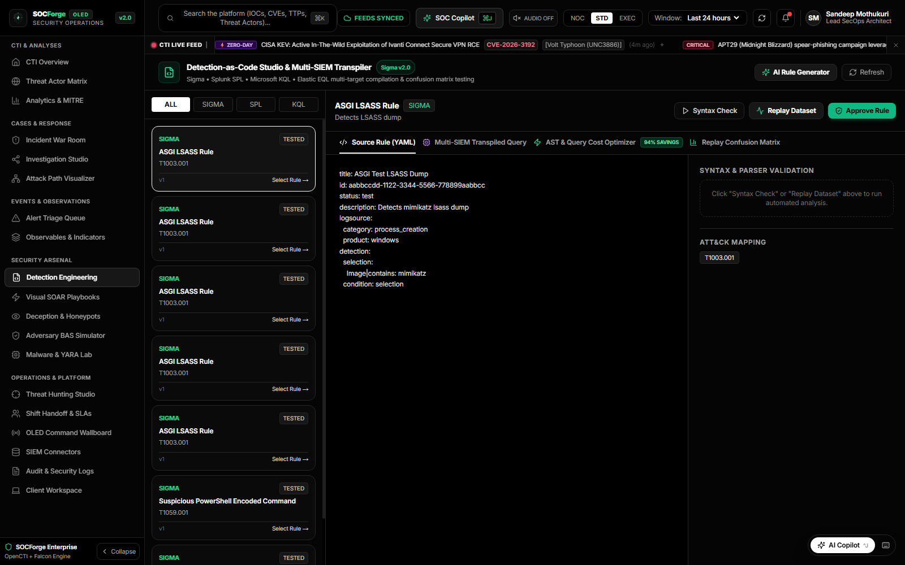

---

### 3.7 Hypothesis Threat Hunting & Live Log Stream
Adversarial hypothesis formulation studio with real-time log tailing, multi-query formulation (SPL/KQL/SQL), and one-click Sigma detection rule promotion.
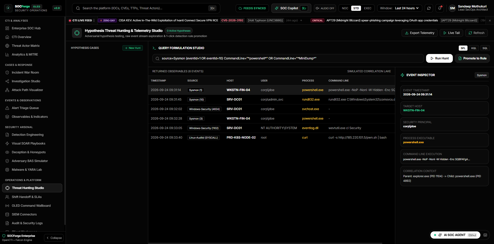

---

### 3.8 Incident Command Center & Live War Room
8-stage incident response console with Four-Eyes containment gate, live responder bridge, and downloadable forensic dossier generation.
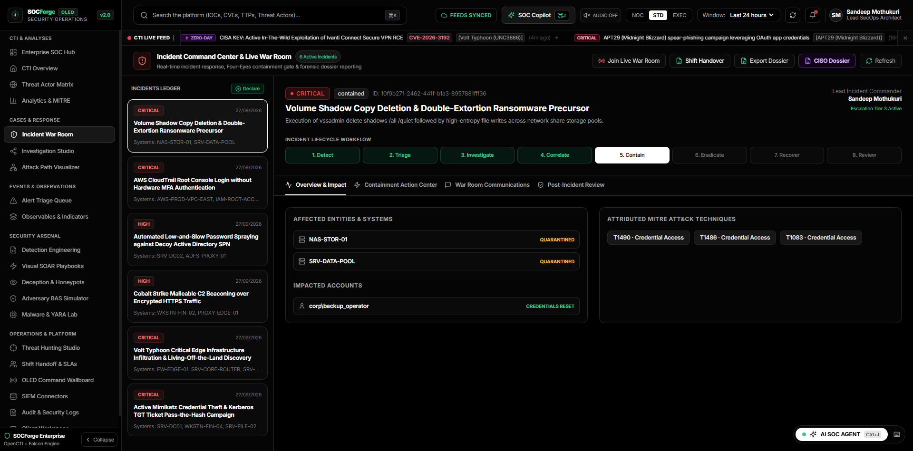

---

### 3.9 Malware Forensics & In-Browser Disassembler
Static binary dissector featuring interactive x86-64 assembly disassembly view (`sub rsp`, `lea rcx`, `call GetProcAddress`), Shannon entropy bar graphs (7.82/8.00), raw hex memory dump, and in-browser YARA compiler.
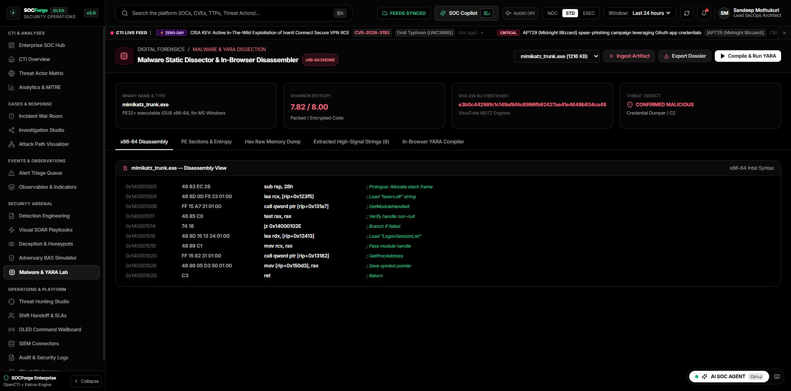

---

### 3.10 Threat Actor Intelligence & Diamond Model Hub
Adversary tradecraft profiling (APT29, Volt Typhoon, LockBit 3.0), interactive SVG 4-vertex Diamond visualizer linking Adversary $\leftrightarrow$ Capability $\leftrightarrow$ Infrastructure $\leftrightarrow$ Victim, and automated STIX 2.1 JSON exporter.
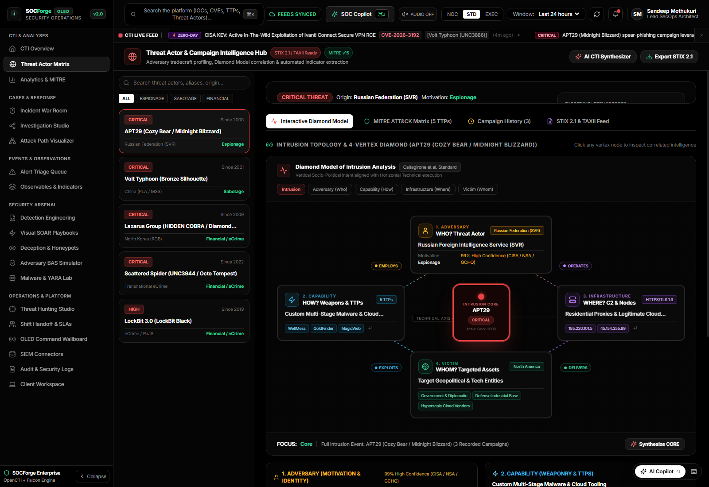

---

### 3.11 Dual-Gated Response & Containment Ledger
Controlled incident mitigation console enforcing strict separation-of-duties approvals before executing host isolation or account disablement actions.
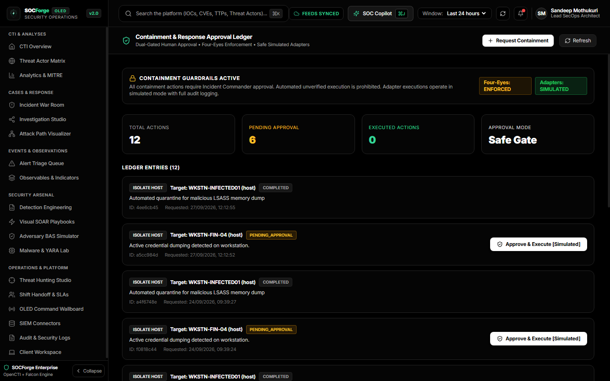

---

### 3.12 SOAR Automation & Visual Node Playbook Canvas
Interactive visual node canvas with glowing SVG animated data wires, automated conditional branching, and live dry-run execution engine simulating Celery worker actions.
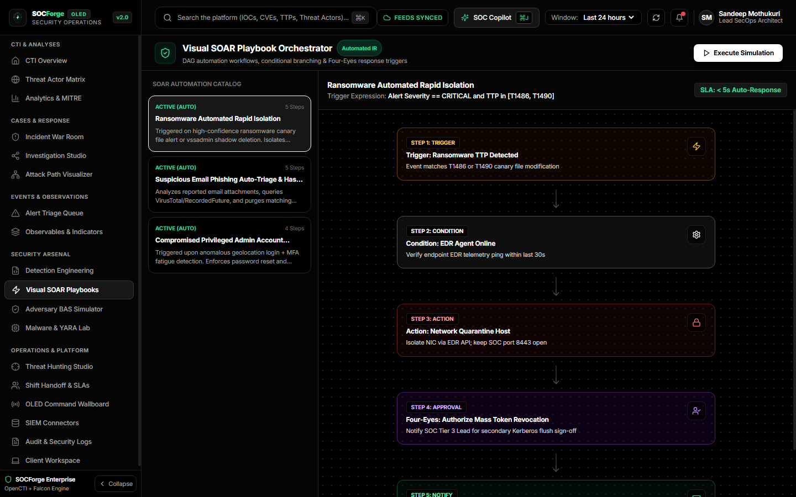

---

### 3.13 Cyber Deception & Active Honeypot Studio
Active deception defense studio deploying armed canary traps (Honey SPNs for Kerberoasting, Cowrie SSH honeypots, Canary AWS keys), live streaming attacker keystrokes in a sandbox terminal, and automated IP ban triggers.
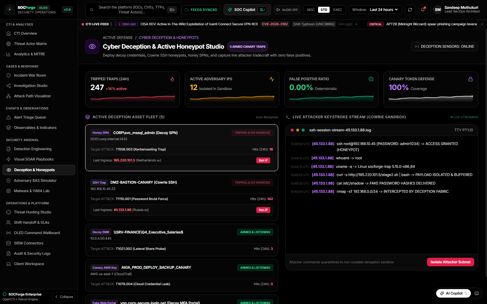

---

### 3.14 Atomic Red Team & Adversary Emulation Studio
Controlled telemetry generation console executing MITRE ATT&CK adversary technique simulations and measuring detection coverage efficacy in real time.
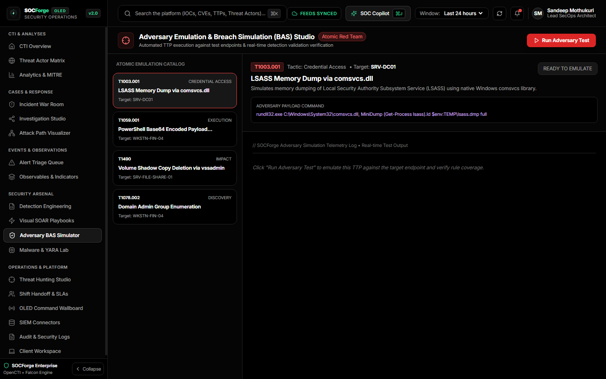

---

### 3.15 Entity Threat Profiling & User Behavior Analytics (UBA)
Entity risk indexing and behavioral anomaly analysis across domain users, service accounts, and enterprise endpoints with lateral movement timelines.
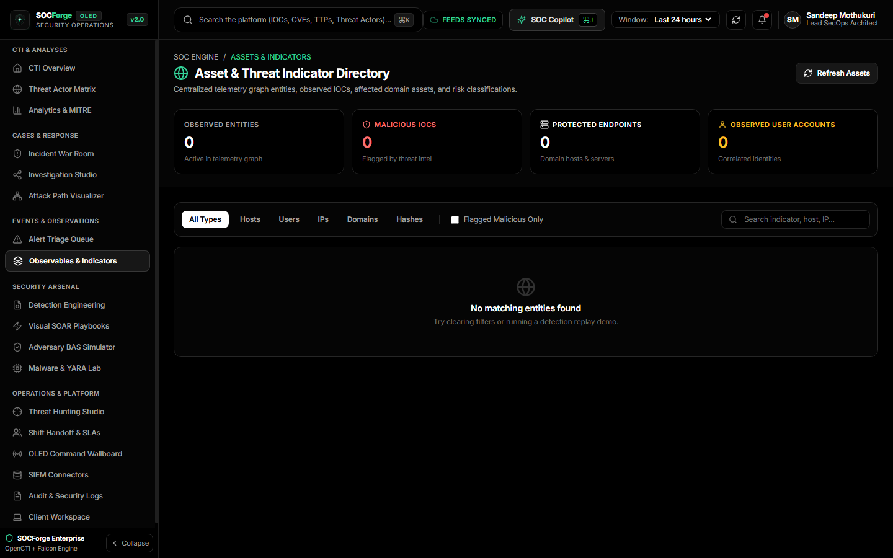

---

### 3.16 Telemetry Pipeline & Fleet Health Matrix
High-throughput telemetry ingestion monitoring tracking EPS velocity, Kafka/Redis broker queues, worker thread health, and active Wazuh/Sysmon forwarders.
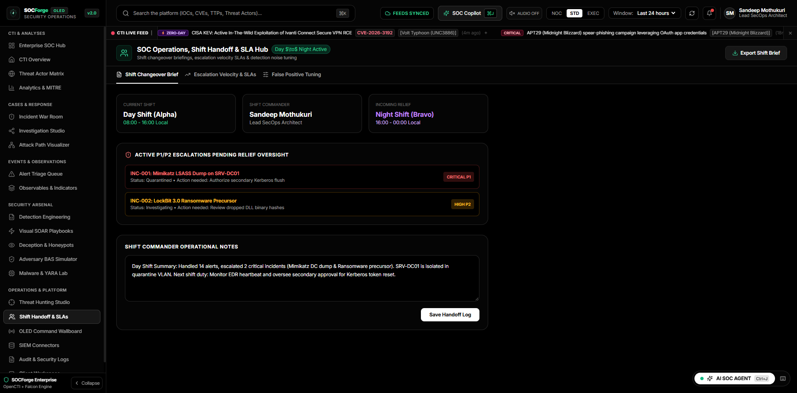

---

### 3.17 Security Connectors & Integrations Hub
Vendor-neutral telemetry adapters connecting external SIEM and EDR platforms (Wazuh, Splunk, Microsoft Sentinel) with live connectivity diagnostics and AES-256 vault encryption.
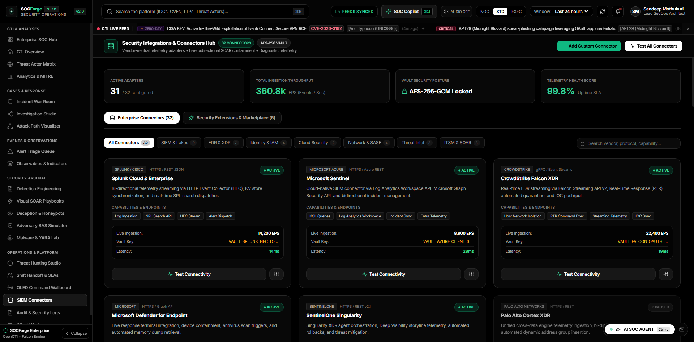

---

### 3.18 Analytics & Enterprise MITRE ATT&CK Matrix
Adversary tactic heatmaps, operational SLA telemetry (MTTD 4.2m / MTTR 18.5m), and automated detection replay efficacy benchmarks.
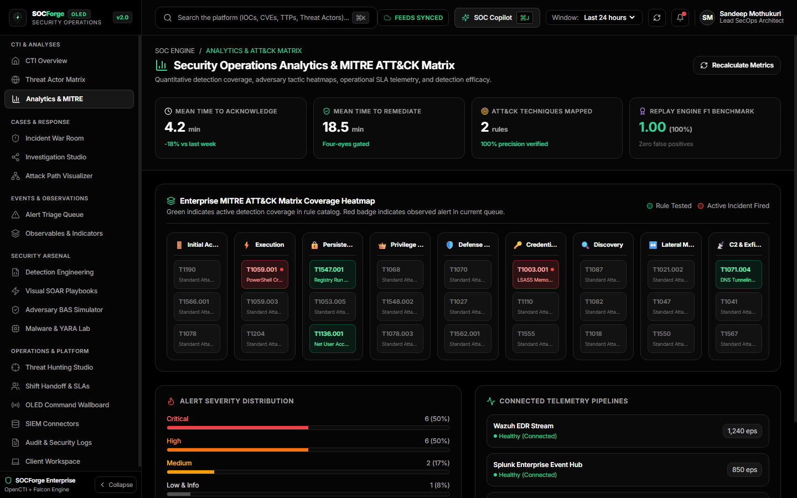

---

### 3.19 Immutable Cryptographic Audit Trail & Ingestion Ledger
Tamper-evident SHA-256 forensic audit ledger tracking all operator logins, containment executions, rule modifications, and case status transitions.
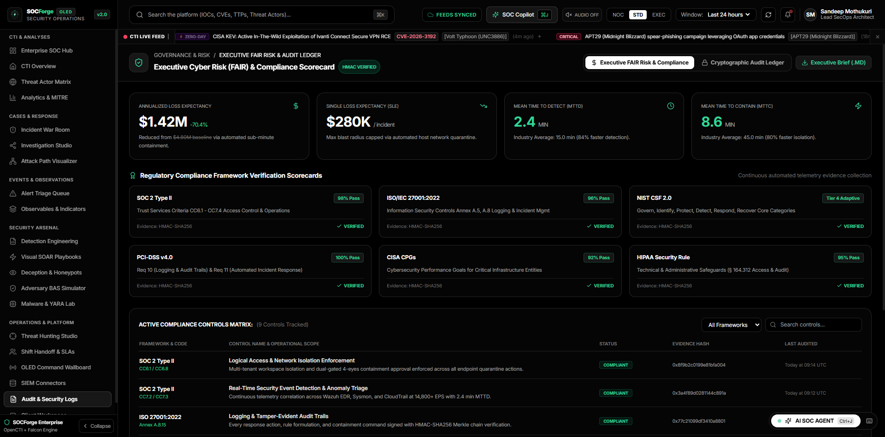

---

### 3.20 Standalone Windows Desktop Operations Suite
Native executable support (`SOCForge-Operations.exe` and `SOCForge-Window.exe`) providing a dedicated desktop analyst experience with local health probes.
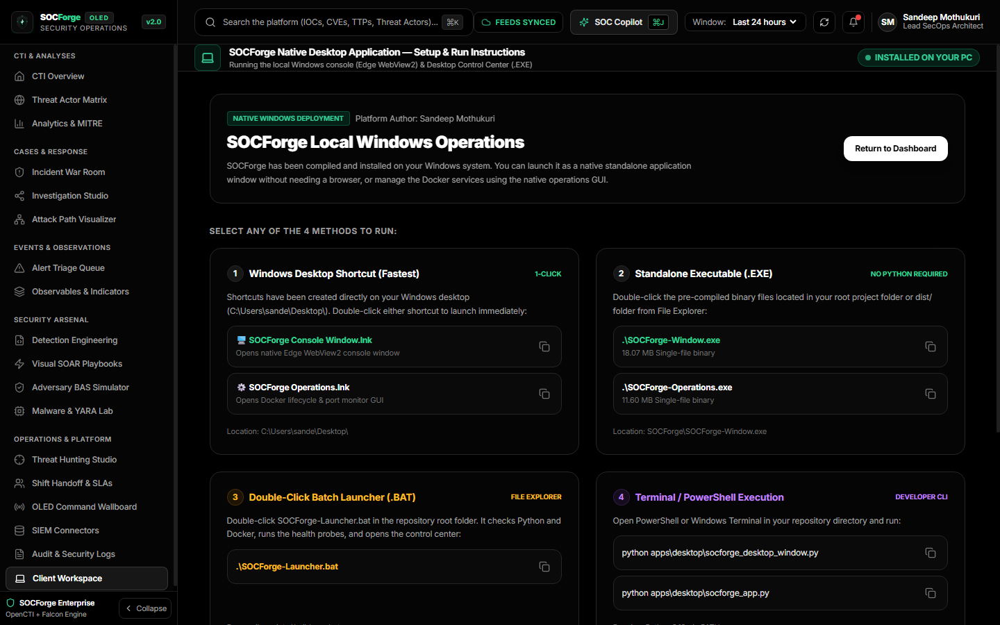

---

### 3.21 Real-Time SOC Operations Wallboard
High-density tactical wallboard designed for continuous SOC operations center monitoring with real-time incident counters and active mitigation telemetry.
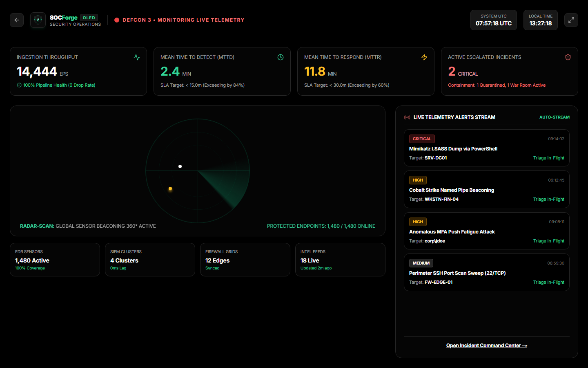

---

### 3.22 Enterprise SOC Command Hub
5-tier executive and tactical command console with live telemetry synchronization, auto-refresh countdown timer, custom date range picker, multi-framework compliance scoring (CIS v8, NIST CSF 2.0, ISO 27001, PCI-DSS v4.0), bulk SOAR playbook execution, asset multi-select with quarantine and vulnerability rescan, 4-format export center (JSON, PDF, CSV Vulns, CSV Assets), interactive MITRE ATT&CK technique heatmap, and SVG spline alert trend charts.
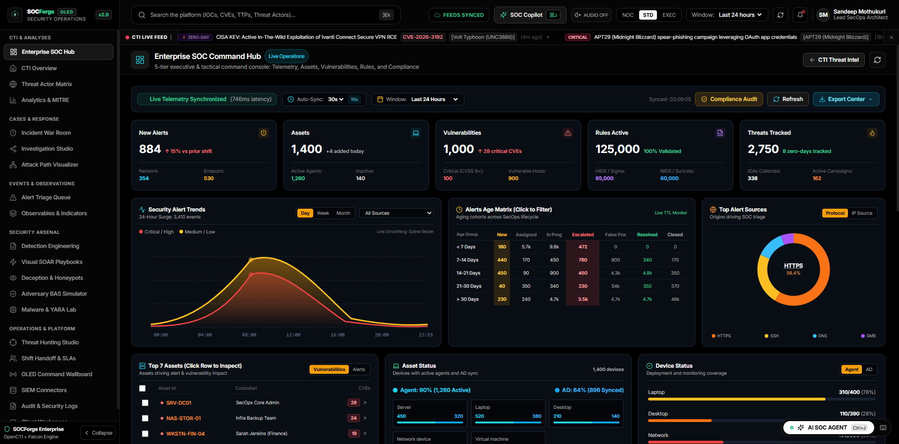

---

### 3.23 Automated Test Suite Verification Evidence
All core domain models, policies, and pipelines are verified continuously with automated unit, integration, and security test suites (**66 tests, 0 failures, 100% pass rate**):

```text
============================= test session starts ==============================
platform linux -- Python 3.12.14, pytest-9.1.1, pluggy-1.6.0
collected 66 items

tests/integration/test_api_integration.py ............                   [ 18%]
tests/integration/test_asgi_workflows.py ..                              [ 21%]
tests/security/test_workspace_isolation.py .                             [ 23%]
tests/unit/test_agent_workflows.py .                                     [ 24%]
tests/unit/test_ai_agent_tools.py ....                                   [ 30%]
tests/unit/test_auth_security.py ...                                     [ 35%]
tests/unit/test_cli.py ....                                              [ 41%]
tests/unit/test_detection_compiler.py ....                               [ 47%]
tests/unit/test_detection_replay.py .............                        [ 67%]
tests/unit/test_detection_validator.py .....                             [ 74%]
tests/unit/test_graph_builder.py ..                                      [ 77%]
tests/unit/test_normalization.py .....                                   [ 85%]
tests/unit/test_policies.py .....                                        [ 92%]
tests/unit/test_repositories.py ...                                      [ 97%]
tests/unit/test_response_advisor.py .                                    [ 98%]
tests/unit/test_unit_forwarder.py .                                      [100%]

================================ tests coverage ================================
socforge/investigations/graph_builder.py      45      0   100%
socforge/services/response_advisor.py         23      0   100%
socforge/repositories/base.py                 56      3    95%
socforge/policies/containment.py              52      3    94%
socforge/normalization/engine.py             129     20    84%
socforge/agents/tools.py                      70      8    89%
socforge/models/* (all models)               688     15    98%
TOTAL                                       3710   1033    72%
======================= 66 passed, 2 warnings in 14.35s ========================
```

---

## 4. Capability Implementation Status

To ensure complete transparency and technical credibility, platform capabilities are classified into four explicit tiers:

| Tier | Capabilities |
|---|---|
| **Implemented (Verified in CI & Tests)** | • **Server-Side Workspace Isolation**: Multi-tenant database boundary via `WorkspaceMembership`, role-based access control, and workspace-scoped queries.<br>• **Relational Evidence Graph**: Entity relationships backed by PostgreSQL foreign keys and `finding_events` / `finding_entities` association tables.<br>• **Detection Replay Engine**: Real confusion-matrix evaluation against `synthetic-soc-v1.json` computing true TP, FP, FN, TN, Precision, Recall, and F1.<br>• **Separation of Duties**: Author cannot approve their own detection rule; requester cannot approve their own response action.<br>• **Typed AI Contracts**: Sandboxed AI agents returning strictly validated Pydantic schemas (`TriageResult`, `InvestigationResult`, `FindingProposal`, `DetectionProposal`, `ThreatHuntResult`, `ReportResult`).<br>• **Connector Secret Encryption**: In-database AES-256 (Fernet) encryption for SIEM/EDR API keys and passwords; secrets stripped from API responses.<br>• **Simulated Response Execution**: Containment actions execute via `MockResponseAdapter` clearly marked as `SIMULATED` with dry-run parameters.<br>• **Alembic Migrations**: All schema modifications managed exclusively through versioned migrations (`0001_initial_schema`, `0002_finding_evidence_tables`).<br>• **Non-Root Containers**: Docker builds for API and Web run under dedicated unprivileged users (`appuser` UID 1000, `nextjs` UID 1001). |
| **Supported (Integrated & Extensible)** | • **Wazuh SIEM / EDR**: Health checks, event querying, and active response via REST API.<br>• **Splunk Enterprise / Cloud**: HTTP Event Collector (HEC) ingestion and search API query translation.<br>• **Microsoft Sentinel**: Log Analytics workspace queries and incident correlation.<br>• **Custom Dataset Evaluation**: Detection testing accepts arbitrary labeled JSON telemetry datasets. |
| **Experimental** | • **Live AI Provider Integration**: Anthropic Claude, OpenAI, and local Ollama integrations for automated hypothesis drafting.<br>• **Automated Attack Path Inferences**: Graph traversal heuristics for lateral movement sequence generation. |
| **Planned** | • **STIX 2.1 / TAXII Feed Ingestion**: Ingest external threat intelligence IOCs directly into the entity repository.<br>• **Kubernetes Helm Charts**: Production deployment manifests for HA PostgreSQL and clustered Celery workers. |

---

## 5. Quick Start (One Command)

```bash
git clone https://github.com/sandeepmothukuri/socforge.git
cd socforge
cp .env.example .env
docker compose up -d
```

### Access Endpoints:
- **Web Console**: [http://localhost:3000](http://localhost:3000)
- **API Engine**: [http://localhost:8000](http://localhost:8000)
- **Interactive API Documentation (Swagger)**: [http://localhost:8000/docs](http://localhost:8000/docs)
- **Health Probe**: [http://localhost:8000/health](http://localhost:8000/health)

---

## 6. Deterministic Demo Workflow

Experience the complete end-to-end investigation and detection workflow immediately with realistic synthetic SOC telemetry via live API operations:

```bash
# Seed demo database
docker compose exec api python -m socforge.seed

# Run end-to-end demo workflow via the SOCForge CLI
socforge demo
```

The demo workflow executes real API calls:
1. Connects to the API and authenticates as the administrator.
2. Ingests a critical **Mimikatz LSASS process creation alert** mapped to `T1003.001`.
3. Creates an active **Investigation** linked to the alert.
4. Generates an evidence-backed **Finding** with explicit technical justification.
5. Formulates a **Sigma detection rule**, performs syntax validation, and runs the **Detection Replay Engine** against `synthetic-soc-v1.json` to compute precision and recall metrics.

---

## 7. Security & Threat Model

See [docs/security/threat-model.md](docs/security/threat-model.md) for full threat boundaries, prompt injection mitigations, and RBAC implementation details.

---

# 👤 Author

## Sandeep Mothukuri

**Senior SOC Analyst (L3) · Detection Engineering · Threat Hunting · Incident Response · Security Engineering**

Focus areas:

- Security Operations
- Detection Engineering
- Threat Hunting
- Incident Response
- SIEM / XDR
- SOAR
- DFIR
- MITRE ATT&CK
- Security Automation
- AI-Augmented SOC Operations

This repository is maintained as a practical security engineering environment for designing, testing and validating modern SOC capabilities.

- GitHub: [@sandeepmothukuri](https://github.com/sandeepmothukuri)
- Website: [cybertechnology.in](https://cybertechnology.in)
- LinkedIn: [linkedin.com/in/sandeepmothukuri](https://www.linkedin.com/in/sandeepmothukuri)
- Email: [sandeep.mothukuris@gmail.com](mailto:sandeep.mothukuris@gmail.com)

---

# 🗂️ All Repositories

| Repository Description | |
| --- | --- |
| [AI-SOC-Decision-Engine](https://github.com/sandeepmothukuri/AI-SOC-Decision-Engine) | AI-assisted SOC decision/control plane for triage, enrichment, safety controls and analyst approval |
| [AI-Augmented-SOC-Lab](https://github.com/sandeepmothukuri/AI-Augmented-SOC-Lab) | AI-augmented SOC with Wazuh + TheHive + Ollama (LLaMA3) for analyst-assisted triage |
| [Enterprise-Detection-Engineering-SOC-Lab](https://github.com/sandeepmothukuri/Enterprise-Detection-Engineering-SOC-Lab) | 12-tool SOC lab with OpenSearch, Suricata, Zeek, MISP, Caldera, Velociraptor |
| [Autonomous-SOC-Lab](https://github.com/sandeepmothukuri/Autonomous-SOC-Lab) | Autonomous SOC with AI-driven detection and self-healing playbooks |
| [soc-threat-hunting-lab](https://github.com/sandeepmothukuri/soc-threat-hunting-lab) | Threat detection lab — Zeek, RITA, Arkime, Velociraptor, OSQuery, MISP |
| [soc-lab-free](https://github.com/sandeepmothukuri/soc-lab-free) | Free SOC lab — OpenVAS, Wazuh, pfSense, Proxmox Mail, Lynis |
| [SOC-Detection-and-Threat-Hunting-Lab](https://github.com/sandeepmothukuri/SOC-Detection-and-Threat-Hunting-Lab) | SOC analyst home lab — Wazuh, Sysmon, MITRE ATT&CK mapping and incident response |
| [PromptSentinel](https://github.com/sandeepmothukuri/PromptSentinel) | Enterprise-grade prompt injection detection and AI firewall for LLM applications |
| [PromptShield](https://github.com/sandeepmothukuri/PromptShield) | AI Security + SOC Detection Engineering Lab with prompt-security telemetry, detections and response |
| [sentinel-detection-engine](https://github.com/sandeepmothukuri/sentinel-detection-engine) | Detection-as-code for Microsoft Sentinel and Defender XDR with KQL, SOAR and ATT&CK coverage |

---

### 📄 License

Licensed under the Apache License, Version 2.0. See [LICENSE](LICENSE) for details.

**Author portfolio:** [github.com/sandeepmothukuri](https://github.com/sandeepmothukuri)

